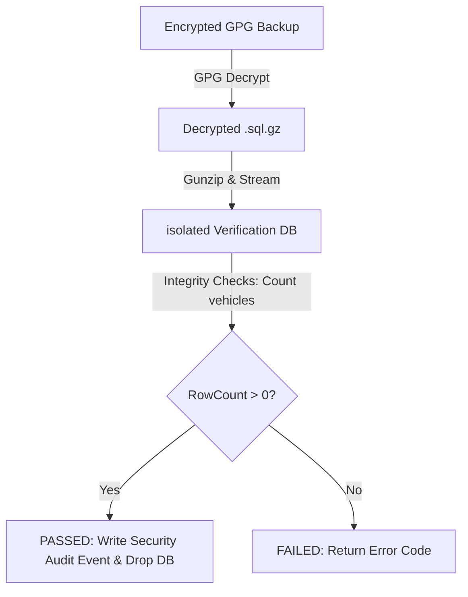

# BACKUP STRATEGY REPORT
**IVMS Production Environment Audit & Enterprise Design**
**Date:** May 31, 2026
**Status:** Completed (Audit & Planning Only)

---

## 1. Current Backup Infrastructure Audit

The primary database backup pipeline relies on two bash scripts located in `scripts/`:
1. `backup_encrypted.sh`: Runs database snapshots.
2. `restore_encrypted.sh`: Performs disaster recovery (DR) restoration verification.

### 📋 Audited Capabilities & Technical Parameters

* **Automation**: Scheduled via local Cron or executed manually during deployment (there is no Celery-based backup scheduler, nor a centralized orchestrator).
* **Backup Mechanism**:
  * Calls `pg_dump` inside the `ivms-db` container.
  * Streams the snapshot directly through `gzip`.
  * Compresses and writes to a temporary `/tmp/` file.
* **Encryption**: 
  * Uses **GPG/PGP Symmetrical Encryption** with the **AES-256** cipher.
  * Hardcoded default password: `OmanComplianceSecret2026` (overridable via `IVMS_BACKUP_PASSPHRASE` environment variable).
* **Storage Location**: Local-only. Backups are stored in `/root/ivms_project/backups/` on the same VPS SSD.
* **Retention Policy**: Enforces a strict **7-day rotation**. Any GPG file older than 7 days is automatically pruned via `find -mtime +7 -exec rm -f {}`.
* **Audited Live Backup Assets**:
  * `ivmsdb_backup_20260527_085915.sql.gz.gpg` (3.74 MB)
  * `ivmsdb_backup_20260526_121254.sql.gz.gpg` (3.44 MB)
  * `ivmsdb_backup_20260526_120733.sql.gz.gpg` (3.44 MB)

---

## 2. Recovery & Verification Audit

The system is equipped with an advanced restore verification mechanism in `scripts/restore_encrypted.sh`.



### Audited Verification Flow
1. Decrypts the symmetrical GPG file to `/tmp/ivmsdb_decrypted_[TS].sql.gz`.
2. Creates an isolated database `ivmsdb_verify` on the same TimescaleDB server.
3. Restores the database schema and data into `ivmsdb_verify`.
4. Runs integrity checks: Queries `SELECT COUNT(*) FROM vehicles;`.
5. If rows exist, logs a `DR_VALIDATION_PASSED` event to the `security_audit` table.
6. Drops `ivmsdb_verify` and cleans up `/tmp/` files.

---

## 3. Critical Backup Deficiencies (Enterprise Risk Analysis)

While the PGP encryption and restore verification scripts are highly advanced, the current deployment model exhibits several **high-risk architectural weaknesses**:

### 🔴 Risk 1: Local-Only Backup Storage (Single Point of Failure)
All backups are saved under `/root/ivms_project/backups/` on the active host filesystem.
* **Impact**: If the VPS hardware fails, the SSD corrupts, or the hosting provider experiences a catastrophic outage, **both live data and backups will be lost simultaneously**.
* **Enterprise Severity**: **CRITICAL**.

### 🔴 Risk 2: Symmetrical Passphrase Exposure
Symmetric encryption uses a static passphrase (`OmanComplianceSecret2026`). If an attacker gains read access to the `.env` file or script, they can decrypt all past backups.
* **Enterprise Severity**: **HIGH**.

### 🟡 Risk 3: Tight 7-Day Retention Limit
A 7-day retention is inadequate for enterprise auditing, compliance, and billing reconciliation (e.g., driver attendance, monthly reports, maintenance history).
* **Enterprise Severity**: **MEDIUM**.

---

## 4. Proposed Enterprise Backup Architecture

To onboard GCC/Oman enterprise, government, and logistics customers, the backup strategy must be redesigned for high availability and compliance:

```
[Production VPS]
       │
       ├── (1) Daily pg_dump + Gzip
       ├── (2) AES-256 Symmetric Encryption (KMS Key)
       │
       ▼
[Local /backups/ (7 Days)]
       │
       ├── (3) Secure Rsync / TLS Tunnel
       │
       ▼
[Primary Oman S3 Storage (Oman Data Park)] ── (4) GFS Policy (30 Days)
       │
       ├── (5) Cross-Region Sync
       │
       ▼
[DR Oman S3 Storage (Omantel / Ooredoo)] ── (6) Cold Archiving (5+ Years)
```

### 📋 Recommended Enterprise Parameters

1. **Off-site Geographic Redundancy (Sovereign Cloud)**:
   * Keep a 7-day local cache for instant recovery.
   * Replicate encrypted backups immediately to an Oman-based S3 object storage provider (e.g., Oman Data Park or Ooredoo Sovereign Cloud) using secure TLS 1.3 transfer.
2. **KMS & HSM Integration**:
   * Integrate GPG encryption with a Key Management Service (KMS) or Hardware Security Module (HSM) located inside Oman.
   * Rotate encryption keys automatically every 90 days.
3. **Grandfather-Father-Son (GFS) Retention**:
   * **Daily Backups**: Retain for 30 days on hot S3 storage.
   * **Weekly Backups**: Retain for 12 weeks.
   * **Monthly Backups**: Retain for 12 months.
   * **Annual Backups**: Retain for 5 years in cold storage (Oman-based glacier tier) for long-term legal audit compliance.
4. **Decoupled Recovery Testing**:
   * Automate the execution of `restore_encrypted.sh` inside an isolated weekly CI/CD container rather than on the production database container.
