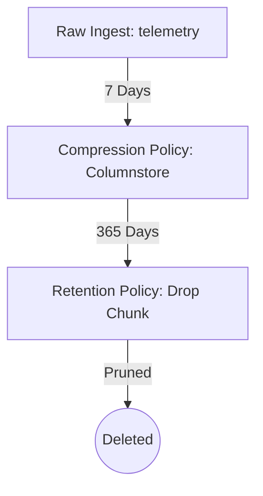

# DATA RETENTION AUDIT REPORT
**IVMS Production Environment Audit**
**Date:** May 31, 2026
**Status:** Completed (Audit & Planning Only)

---

## 1. Executive Summary

This Data Retention Audit evaluates the live Intelligent Vehicle Management System (IVMS) production environment. Currently, IVMS uses TimescaleDB (v15-pg) to manage raw telemetry and event streams. While the system possesses built-in TimescaleDB retention and compression policies, several operational tables do not have corresponding clean-up policies, presenting a major risk of silent disk exhaustion at scale.

At the current production load of **7 active vehicles**, the infrastructure is stable. However, onboarding more vehicles without implementing the retention optimizations detailed below will lead to disk saturation.

---

## 2. Current Table Sizes & Database Profile

The total active database size of `ivmsdb` is **109 MB** containing **47 tables**.

### Table Metrics (Audited Live Values)

| Table | Hypertable | Current Size | Daily Growth (7 Active Vehicles) | Monthly Growth (7 Active Vehicles) | Estimated Row Size |
| :--- | :---: | :--- | :--- | :--- | :--- |
| `telemetry` | **Yes** | 63.26 MB | 8.4 MB (uncompressed) / 157 KB (compressed) | 252 MB (uncompressed) / 4.7 MB (compressed) | ~800B uncompressed / ~15B compressed |
| `live_position_updates` | No | 13.00 MB | 2.41 MB | 72.30 MB | ~230 bytes |
| `system_events` | **Yes** | 6.16 MB | 340 KB | 10.20 MB | ~200 bytes |
| `analytics_events` | **Yes** | 4.34 MB | 120 KB | 3.60 MB | ~220 bytes |
| `notification_queue` | No | 2.89 MB | 160 KB | 4.80 MB | ~230 bytes |
| `system_alerts` | No | 2.59 MB | 150 KB | 4.50 MB | ~200 bytes |
| `rfid_events` | No | 0.95 MB | 40 KB | 1.20 MB | ~240 bytes |
| `telemetry_archive` | No | 0.92 MB | 0 KB | 0 KB | N/A (Static) |
| `telemetry_2026_05` | No | 0.69 MB | 0 KB | 0 KB | N/A (Static) |
| `telemetry_legacy` | No | 0.68 MB | 0 KB | 0 KB | N/A (Static) |
| `live_vehicle_status` | No | 0.18 MB | Static (~180 KB) | Static (~180 KB) | ~1.6 KB per vehicle |
| `devices` | No | 0.12 MB | Static | Static | ~1.1 KB per device |
| `vehicles` | No | 0.08 MB | Static | Static | ~800 bytes per vehicle |
| `drivers` | No | 0.07 MB | Static | Static | ~15 KB per driver |
| `security_audit` | **Yes** | 0.07 MB | 5 KB | 150 KB | ~120 bytes |
| *Others (32 tables)* | No | ~1.50 MB | Negligible | Negligible | Varies |
| **TOTAL** | - | **109.00 MB** | **~11.5 MB/day** | **~345 MB/month** | **-** |

---

## 3. Active Retention & Compression Policies

TimescaleDB manages continuous data lifecycle for hypertables using automated background jobs:



### Audited Policies (TimescaleDB Catalog)

1. **`telemetry` (Hypertable ID 2)**:
   * **Compression Policy**: Activated. `compress_after => '7 days'`.
   * **Retention Policy**: Activated. `drop_after => '365 days'` (1 year).
   * **Status**: Fully functional. Chunks older than 7 days are compressed via column-oriented compression, resulting in an audited **~40x reduction in table size** (compressed chunks take only 1.9B to 7.7B per row compared to ~800B uncompressed).

2. **`analytics_events` (Hypertable ID 10)**:
   * **Compression Policy**: Disabled.
   * **Retention Policy**: Activated. `drop_after => '180 days'` (6 months).
   * **Status**: Works as expected but misses compression optimizations.

3. **`security_audit` (Hypertable ID 13)**:
   * **Compression Policy**: Disabled.
   * **Retention Policy**: Activated. `drop_after => '365 days'` (1 year).
   * **Status**: Active. Audits security-critical changes.

4. **`system_events` (Hypertable ID 1)**:
   * **Compression Policy**: Disabled.
   * **Retention Policy**: **None**.
   * **Status**: **Critical Vulnerability**. System events and background errors are written to this table forever without automatic pruning.

---

## 4. Critical Audit Findings

### ⚠️ Finding 1: The `live_position_updates` Storage Leak
Every telemetry ingest triggers a live position reconciliation, writing a row to `live_position_updates` for real-time tracking audit logs. Because this is a **standard PostgreSQL table** and lacks any partition, retention, or compression policies, it grows by **~2.4 MB/day** for just 7 active vehicles (345 KB/day per vehicle). At scale (e.g., 1,000 vehicles), this single table will grow by **345 MB/day (10.3 GB/month)** and eventually exhaust the primary disk.

### ⚠️ Finding 2: Unpruned Operational Logs
Tables like `system_events`, `system_alerts`, `notification_queue`, and `rfid_events` lack automated cleanup routines. Although `tasks/cleanup.py` defines a Celery task stub named `perform_db_maintenance()`, its body contains no SQL commands and does nothing:
```python
@celery_app.task
def perform_db_maintenance():
    logger.info("Starting database maintenance and retention cleanup...")
    # SQL logic for VACUUM and retention policies
    return {"status": "success"}
```

### ⚠️ Finding 3: Static Historical Telemetry Clutter
Legacy tables (`telemetry_legacy`, `telemetry_archive`, `telemetry_2026_05`) are standard tables taking up storage space without any compression or archiving scheme applied.

---

## 5. Storage Growth under Current Configuration

### How long can IVMS currently store data?
1. **At Current Production Load (7 Active Vehicles)**:
   * Telemetry is retained for **1 year** (pruned automatically).
   * The database grows by ~11.5 MB/day (~345 MB/month).
   * Given **76 GB of available disk space**, the system can run for **~18 years** before physical disk exhaustion.
2. **At Registered Capacity (108 Vehicles)**:
   * Telemetry grows to 162,000 records/day.
   * Total daily database growth rises to **45 MB/day (~1.35 GB/month)**.
   * The current disk will become full in **~4.6 years**.
3. **At Enterprise Scale (e.g., 1,000 Vehicles)**:
   * The database grows by **417.5 MB/day (~12.5 GB/month)**.
   * The current disk will saturate in **~6 months**, causing total ingestion failure.

---

## 6. Recommendations & Remediations

1. **Convert Audit Tables to Hypertables**:
   * Convert `live_position_updates` and `system_alerts` to TimescaleDB hypertables.
2. **Enable Compression Policies**:
   * Enable compression on `system_events` and `analytics_events` after 14 days.
3. **Implement the Celery Cleanup Task**:
   * Implement a query in `perform_db_maintenance` to prune non-hypertable logs (e.g., delete `notification_queue` and `rfid_events` older than 30 days, vacuuming tables regularly).
