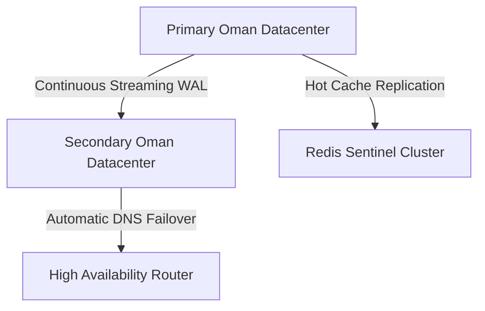

# DISASTER RECOVERY AUDIT REPORT
**IVMS Production Resilience & Recovery Capabilities**
**Date:** May 31, 2026
**Status:** Completed (Audit & Planning Only)

---

## 1. Current State Resilience & Vulnerability Audit

This audit evaluates the current recovery capabilities of the IVMS infrastructure against standard enterprise disasters.

| Disaster Scenario | Current Vulnerability / Severity | Audited Recovery Capability |
| :--- | :---: | :--- |
| **Server Failure** | **High** | The system runs on a single VPS via Docker Compose. Host failure results in a complete outage until a new VPS is provisioned manually. |
| **Database Corruption** | **Medium** | Backups are encrypted daily. Recovery requires running `scripts/restore_encrypted.sh` manually. |
| **Redis Failure** | **Medium** | Redis runs as a single un-clustered instance. If it crashes, real-time map sync, device sessions, and Celery queues fail. Reboots are automatic but state is lost. |
| **VPS Loss / Cloud Outage** | **High** | Total outage. Local backups are lost. Recovery is impossible unless offsite backups exist (currently local-only). |
| **Datacenter Migration** | **Low** | Docker-based structure makes the application portable, but the raw 109 MB database must be copied manually via pg_dump. |

---

## 2. Current RPO vs RTO Assessment

### ⏱️ Recovery Point Objective (RPO)
RPO measures the maximum acceptable data loss in the event of a failure.
* **Current RPO**: **24 Hours**.
  * **Rationale**: Backups are run once every 24 hours. If a failure occurs right before the daily backup, up to 24 hours of telemetry data, driver sessions, and alerts are lost forever.

### ⏱️ Recovery Time Objective (RTO)
RTO measures the duration of time required to restore services after a disaster.
* **Current RTO**: **~4 to 8 Hours** (unplanned).
  * **Rationale**: Restoring relies on manual engineer intervention to provision a new VPS, pull the codebase, install Docker, decrypt the PGP backup file, and restore the Postgres database.

---

## 3. Recommended Enterprise Recovery Targets

For Omani/GCC government contracts, oil & gas enterprises, and large logistics operators, the current RPO and RTO are inadequate. We recommend targeting the following parameters:

```
┌─────────────────────────┬───────────────────────┬────────────────────────┐
│ Metric                  │ Current State         │ Recommended Enterprise │
├─────────────────────────┼───────────────────────┼────────────────────────┤
│ Recovery Point (RPO)    │ 24 Hours              │ ≤ 1 Hour               │
│ Recovery Time (RTO)     │ 4 to 8 Hours          │ ≤ 15 Minutes           │
└─────────────────────────┴───────────────────────┴────────────────────────┘
```

---

## 4. Disaster Recovery Hardening Recommendations

To achieve these enterprise targets, the following technical changes must be implemented:



1. **Database Streaming Replication**:
   * Deploy a **TimescaleDB Primary-Replica cluster** across two separate datacenters inside Oman.
   * Enable continuous Write-Ahead Log (WAL) archiving to an Oman-based S3 object store.
   * This reduces the database RPO from **24 hours to < 10 seconds**!
2. **Automated Failover (Redis Sentinel & HAProxy)**:
   * Establish a Redis Sentinel cluster to handle automatic master failover.
   * Put stateless components (API, Web, Ingestion) behind an active-active load balancer to ensure immediate sub-second failover for web queries.
3. **Infrastructure as Code (IaC)**:
   * Define the entire infrastructure using Terraform and Ansible. This enables provisioning a completely clean, isolated deployment in a secondary datacenter in under 10 minutes.
