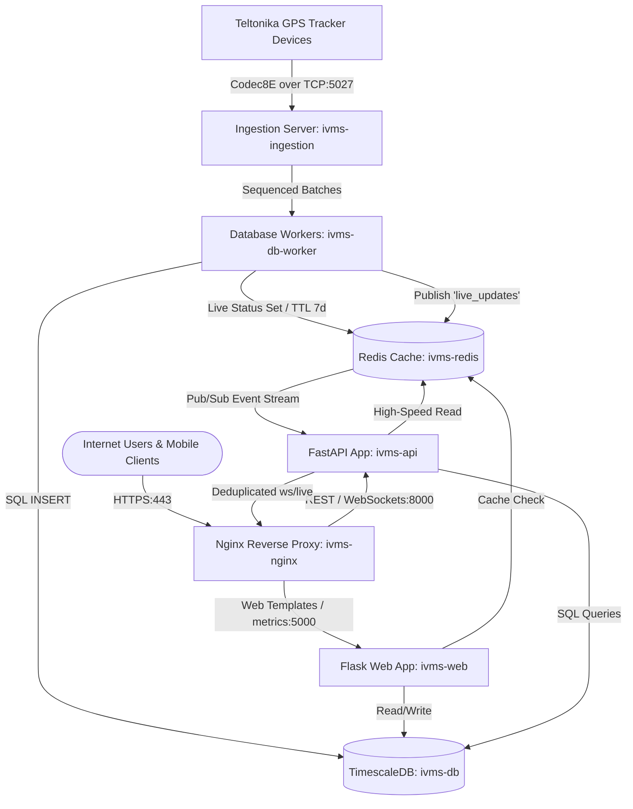
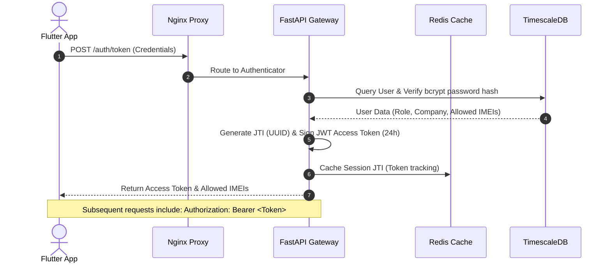
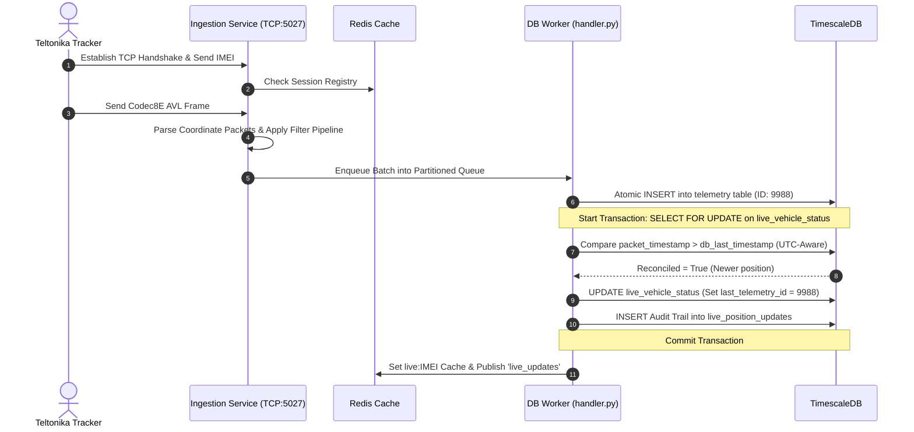

# IVMS Mobile Application System Architecture Audit & Readiness Assessment

---

## 1. Executive Summary

This report delivers a comprehensive **Mobile App Readiness Assessment** and **Architecture Audit** for the Intelligent Vehicle Management System (IVMS) production platform. The assessment evaluates the system’s readiness to support native/hybrid Android and iOS mobile applications built with Google Flutter, identifying critical architectural gaps, performance bottlenecks, and security considerations.

### Overall Verdict & Readiness Score
The IVMS platform has a highly sophisticated, production-grade foundation. Its dual-service microservices architecture, robust Teltonika Codec8E real-time ingestion pipeline, and atomic live position reconciliation engine are exceptionally well-engineered. However, the system is currently **NOT fully ready for mobile application deployment** without key backend modifications, specifically in token session management, mobile-optimized query serialization, and push notification infrastructure.

### Segmented Readiness Ratings

| Readiness Dimension | Score | Rating | Strategic Assessment |
| :--- | :---: | :---: | :--- |
| **Backend Infrastructure** | **84 / 100** | **Excellent** | Extremely robust telemetry processing, Redis caching layer, and TimescaleDB hypertable timeseries storage. Missing background push notification dispatch engines. |
| **API Readiness** | **68 / 100** | **Fair** | Wide API coverage, but heavily optimized for desktop rendering with large payload footprints, lacking native pagination, filtering, and mobile KPI aggregations. |
| **Security & Authentication** | **74 / 100** | **Good** | Strong hybrid JWT and cookie-based authentication, but lacks public OAuth2/OIDC refresh token routes and multi-device session invalidation. |
| **Real-Time Capabilities** | **88 / 100** | **Excellent** | High-performance Redis Pub/Sub stream with 100ms deduplication and JWT query parameter support. Limited horizontal scaling due to in-memory socket registries. |
| **Mobile Readiness (Overall)** | **70 / 100** | **Good** | Solid core foundation. The platform is ready to begin client-side development immediately, provided the identified backend gaps are bridged in parallel. |
| **COMPOSITE IVMS SCORE** | **77.2 / 100** | **Good Foundation** | **Ready for Development with Prep Work** |

---

## 2. Production Topology & System Architecture

The IVMS production topology is built around a containerized multi-service architecture hosted via Docker Compose. Telemetry ingestion, API operations, web rendering, caching, and persistent datastores are fully decoupled.



---

## 3. Component Deep Dive & Mobile Audit

### 3.1. Frontend Architecture
* **Current State:** The desktop portal is a traditional multi-tenant server-side rendered (SSR) web application built on **Flask, Jinja2 templates, and vanilla Javascript**. Real-time tracking is handled on the client side via Leaflet maps subscribing to WebSocket update payloads.
* **Mobile Impact:** Unsuitable for mobile reuse. The front-end assets (HTML/CSS/JS) are strictly designed for large desktop viewports. To support mobile, **Google Flutter** will act as a completely independent frontend client, communicating solely through the API gateway. No web assets will be shared.

### 3.2. Backend Services
IVMS operates a modern **dual-framework Python backend**, segregating administrative web portal flows from real-time high-throughput API endpoints.

#### 3.2.1. Flask Services (`app.py`, `routes/`, `services/`)
* **Role:** Serves Jinja2 web templates, handles corporate multi-tenant sessions via browser cookies, compiles complex offline PDF/CSV reports, manages settings, and hosts Prometheus client metrics.
* **Mobile Suitability:** Unsuitable for direct mobile requests. Mobile clients should bypass Flask completely because its controllers rely on stateful cookie sessions (`itsdangerous` serialization) and return heavy HTML layouts. The only exceptions are the Odoo integration reports hosted in the Flask app.

#### 3.2.2. FastAPI Services (`api/main.py`, `api/v1/`, `api/v2/`)
* **Role:** A high-concurrency Uvicorn-backed REST API and WebSocket gateway providing real-time device coordinate synchronization and transactional diagnostic operations.
* **Mobile Suitability:** **Excellent**. FastAPI serves as the definitive entry point for the mobile application. Its endpoints are naturally asynchronous, return clean JSON payloads, support rate limiting via `slowapi`, and utilize Pydantic models for request validation.

### 3.3. Database Architecture
IVMS utilizes a specialized dual-datastore design tailored for massive telemetry timeseries workloads and instant cache resolution.

#### 3.3.1. TimescaleDB (`timescale/timescaledb:latest-pg15`)
* **Usage:** Core persistent storage. Telemetry data is stored in a time-series optimized hypertable utilizing daily partitioning, active compression (enforced after 7 days), and a 90-day hot retention policy. Relational metadata (users, vehicles, drivers, geofenced sites, maintenance tickets) resides in standard Postgres tables.
* **Mobile Impact:** Relational queries are fully indexed. However, TimescaleDB timeseries lookups can yield massive arrays. Mobile clients must never fetch raw telemetry histories directly; they must utilize the `simplify_route` endpoint (`api/v1/reports/history/{imei}`) to prevent mobile memory overflows and battery drain.

#### 3.3.2. Redis (`redis:7-alpine`)
* **Usage:** Stores the active status cache for all registered vehicles (`live:<IMEI>` with a 7-day TTL) and provides the Redis Pub/Sub backplane (`live_updates` channel) for instant positioning broadcasts.
* **Mobile Impact:** **Outstanding**. Redis allows mobile clients to fetch the live status of an entire fleet (`/api/v2/live-status`) in under 5 milliseconds, removing expensive JOIN queries from TimescaleDB.

### 3.4. WebSocket Architecture
* **Implementation:** FastAPI manages connections via `ConnectionManager` inside `api/main.py`. A background thread (`stream_redis_to_ws_with_reconciliation`) listens to the Redis `live_updates` channel, executes a **100ms deduplication sweep per IMEI** to prevent client event storming, and broadcasts JSON updates to connected WebSockets.
* **Mobile Impact:** Highly reusable. Flutter's native WebSocket socket streams can easily hook into `/ws/live`. Authentication is fully integrated to accept JWT tokens passed via query parameters (`/ws/live?token=...`).
* **Scaling Risk:** The `ConnectionManager` stores active socket connections in-memory (`self.active_connections = []`). Under load balancing (multi-VPS deployments), WebSocket connections will be split across different nodes. A Redis-backed cluster socket coordinator will be required to manage connection states across multiple API gateway nodes.

---

## 4. Authentication, Roles, & Tenant Isolation

### 4.1. Mobile Authentication Flow
The mobile app must utilize stateless **JSON Web Tokens (JWT)** for all interactions, avoiding cookies completely.



### 4.2. Role Management & Access Control
IVMS implements four strict role levels, which must be mirrored in the mobile UI:
1. **super_admin:** Total platform visibility, diagnostics, and global tenant controls.
2. **main_admin:** Tenant owner. Can manage vehicles, drivers, geofences, maintenance, and view audit reports.
3. **admin:** Operates within a tenant's context, can issue device commands and geofences.
4. **user:** Read-only access to authorized vehicles (fleet monitoring and live map).

### 4.3. Tenant Isolation Model
Tenant isolation is enforced programmatically in the API layer via a shared-database, tenant-filtering model. The authenticator injects `user_data` into the request context. FastAPI's dependencies (`get_allowed_imeis`) then resolve the allowed IMEIs for that user using the `vehicles` table:
```sql
SELECT unique_id FROM vehicles WHERE unique_id = ANY($1) AND telemetry_environment = $2
```
This query ensures that even if a mobile client manually queries an unauthorized IMEI, the API gateway intercepts the call and yields a `403 Forbidden` response. Data isolation is highly secure.

---

## 5. Telemetry & Ingestion Pipelines

Real-time device position telemetry flows through a high-performance concurrent processing pipeline.



### Mobile Readiness of Telemetry
* **Device Communication:** Handled entirely by the ingestion service. Mobile clients do not participate in or receive raw Codec8E bytes, maintaining decoupling.
* **Position Reconciliation:** Fully mobile-ready. The atomic read-compare-update engine (`reconcile_position` in the db handler) ensures that mobile clients never receive stale or out-of-order coordinate packets when historical batches are replayed.

---

## 6. Integrations Audit

### 6.1. Odoo ERP Integration Flow
* **Flow:** The Odoo ERP integrates with IVMS to fetch daily automated vehicle summaries, fuel logs, and trip reports.
* **Authentication:** Handled via a secure static token (`ODOO_REPORT_TOKEN`) passed as a bearer token header:
  `Authorization: Bearer <ODOO_REPORT_TOKEN>`
* **Routing:** Handled via custom Flask blueprints:
  * `routes/external_reports.py` (`/api/v1/reports/vehicle-summary`)
  * `routes/external_api.py` (`/api/v1/reports/fleet-summary`, `/api/v1/reports/live-status`, `/api/v1/reports/trips`, `/api/v1/reports/fuel-summary`)
* **Mobile Impact:** **None**. These endpoints are dedicated integration routes for automated backend ERP processes. The mobile application will bypass these blueprints entirely, accessing the fleet data via standard FastAPI routes.

### 6.2. AI Copilot Integration Flow
* **Implementation:** The AI Copilot is built as an isolated Python package (`ai_module`) integrated into the Flask web framework.
* **Lexical TF-IDF RAG:** Parses local document formats (`.docx`, `.pdf`, `.txt`) uploaded by the administrator using native Python modules, indexing them into memory for instant document-based retrieval without external heavy databases.
* **SQL translation:** Utilizes an atomic read-only execution engine (`ai_service.py`) that translates user natural-language questions into Postgres SQL queries.
* **Security Controls:**
  * Enforces `readonly=True` and `autocommit=False` with a forced transaction rollback.
  * Restricts queries strictly to a whitelisted array of tables (`vehicles`, `live_vehicle_status`, `telemetry`, `trip_summary`, `analytics_events`, `drivers`, etc.), blocking access to system configurations or credentials.
  * Blocks SQL injections via keyword regex matching (`insert`, `update`, `delete`, etc.).
* **Mobile Gaps:** The current Copilot integration is locked to the Flask ecosystem. The `/ai/chat` endpoint relies on Flask cookie sessions for CSRF protection and role checks. To enable AI Copilot on mobile, a dedicated asynchronous endpoint must be ported to the FastAPI router, using JWT authorization instead of cookies.

---

## 7. Major Architectural Recommendations

1. **Implement Push Notification Broker:** Introduce a containerized Push Notification Service (using Firebase Cloud Messaging) linked to the background database workers to dispatch alerts and reminders directly to mobile clients.
2. **Expose Dedicated Auth Controller in FastAPI:** Create an `/auth/token` endpoint in FastAPI to verify bcrypt passwords and issue standard JWT tokens, eliminating the need to read or decode Flask session cookies on mobile.
3. **Add Mobile Aggregation Endpoint:** Build a single `/api/v2/mobile/dashboard` endpoint returning fleet status counts, active driver counts, today's alerts, and open maintenance tickets in a single network request to minimize mobile battery usage.
4. **Decouple AI Copilot into FastAPI:** Re-host the AI Copilot `/ai/chat` endpoint within the FastAPI router, enabling JWT-authorized RAG document searches and SQL translation queries on mobile devices.
