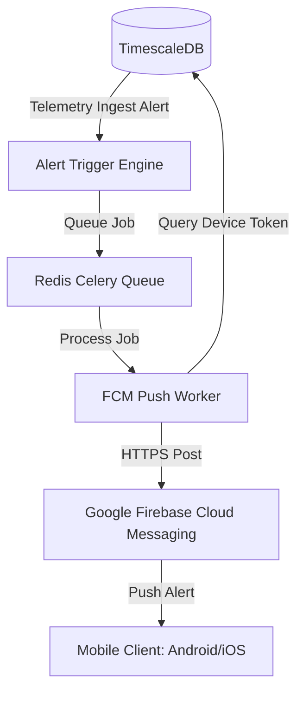

# IVMS MOBILE DEVELOPMENT GAP ANALYSIS

---

This document outlines the detailed architectural, functional, and security gaps between the existing web-based IVMS platform and the requirements for a production-grade Android and iOS mobile deployment.

---

## 1. Authentication & Session Gaps

The current authentication model is designed primarily for web browsers, presenting significant obstacles for native mobile clients.

### 1.1. Session Gaps
* **The Cookie Dependency:** The Flask application (`app.py`) relies heavily on stateful, client-side signed cookies via Werkzeug and `itsdangerous`. Cookies are inherently difficult to manage, store, and secure inside Dart/Flutter environments, which lack automated cookie handling headers.
* **Token Authenticator Integration:** FastAPI does support JWT access tokens (`auth_manager.create_access_token`) and validates them using the `Authorization: Bearer <Token>` header. However, there is **no public POST endpoint** within the FastAPI routers to authenticate credentials and issue tokens directly. The current login flow is locked to Flask's HTML login form.
* **Missing Refresh Token Endpoint:** While `AuthManager` in `auth/jwt_manager.py` supports generating refresh tokens (`create_refresh_token`), there is no REST route to handle token renewal (`POST /auth/refresh`). Without a refresh endpoint, mobile users will be forced to log in with their password every time their 24-hour access token expires, degrading the user experience.
* **Lack of Multi-Device Control:** There is currently no database representation mapping active JWTs to specific devices. If a mobile user logs in on a tablet and a phone, their sessions share the same JTI namespace. Revoking a session terminates all access, and there is no mechanism to list or invalidate individual active devices.

### 1.2. Required Mitigations for Mobile Auth
1. **Implement `/api/v2/auth/login` in FastAPI:** Create an asynchronous endpoint to verify username/password against bcrypt hashes and return:
   ```json
   {
     "access_token": "eyJhbG...",
     "refresh_token": "eyJhbG...",
     "expires_in": 86400,
     "role": "main_admin",
     "company": "Saga Logistics"
   }
   ```
2. **Implement `/api/v2/auth/refresh`:** Allow clients to present a valid refresh token and receive a fresh short-lived access token, preventing user lockouts.
3. **Flutter Secure Storage:** Store the returned JWTs securely inside native hardware using Keychain (iOS) and Keystore (Android) via the `flutter_secure_storage` plugin. Never store tokens in plaintext shared preferences.

---

## 2. Real-Time Capability Gaps

The existing WebSocket streaming architecture is highly performant but introduces challenges for mobile devices.

### 2.1. WebSockets vs. Mobile Network Constancy
* **Connection Drops:** Mobile devices frequently transition between 4G, 5G, and Wi-Fi networks, causing sockets to drop constantly. The existing WebSocket endpoint (`/ws/live`) relies on continuous TCP streaming and does not support message buffering or session resumption for disconnected clients.
* **Battery and Data Exhaustion:** A vehicle fleet generating hundreds of updates per second will cause rapid UI rebuilds in Flutter, quickly draining the device's battery and consuming gigabytes of mobile data.
* **Deduplication Limitations:** The FastAPI backend implements a 100ms deduplication sweep per IMEI, which works well for web dashboards. However, for mobile, this rate is still too fast. Mobile clients need a dynamic throttle control (e.g., updates max once every 2 seconds per vehicle) to preserve battery health.

### 2.2. Horizontal Scaling Risks
* **In-Memory Connection Registries:** The `ConnectionManager` inside `api/main.py` stores active WebSocket connections in a local Python list (`self.active_connections = []`).
* **The Scaling Bottleneck:** If the API gateway is scaled horizontally behind an Nginx load balancer (e.g., running 3 VPS instances), Nginx will distribute mobile WebSocket connections across all 3 nodes. Because there is no shared Redis state for active connections, a message received on Node A will not be broadcast to a client connected to Node B, causing missing real-time tracking events.

---

## 3. Push Notification Deficiency

The complete absence of push notification infrastructure is the largest technical gap on the backend.

### 3.1. Firebase Cloud Messaging (FCM) Integration Gaps
* **No Client Registry Table:** There is no database table to map active users to their FCM registration tokens (`device_token`, `platform`, `user_id`).
* **Missing Trigger Service:** The database workers process telemetry alerts in background threads (`ingestion/db/handler.py`), but they do not have a hook to dispatch push notifications. For instance, when an overspeed event is logged in the `analytics_events` table, the system registers it silently instead of pushing a notification to the user.
* **Lack of APNs Support:** No APNs certificate binding or HTTP/2 transport engine exists in Nginx or the FastAPI configuration to support Apple Push Notifications for iOS clients.

### 3.2. Missing Notification Backend Architecture
To support push notifications, a dedicated background dispatch microservice must be added to the topology:



---

## 4. AI Copilot Mobile Readiness Gaps

The existing AI Copilot blueprint (`ai_module`) is highly advanced but suffers from strict web-coupling and structural limitations that prevent immediate mobile use.

### 4.1. Integration & Authentication Gaps
* **Flask Blueprint Lock:** The `/ai/chat` endpoint is registered as a Flask blueprint and is decorated with web-based authentication hooks. It requires active Flask session cookies and validates `X-CSRF-Token` headers. Mobile clients cannot access these endpoints directly without throwing `400 Bad Request` or `401 Unauthorized` errors.
* **Memory and Context Isolation:** Context memory is tracked via local session scopes. Mobile requires stateless chat tracking, passing a `conversation_id` as part of the JSON request payload and storing chat histories in the `ai_logs` table for consistency across devices.

### 4.2. Language & Translation Gaps
* **Arabic & Hindi Support:** The existing lexical RAG engine (`rag_service.py`) utilizes standard Python regular expressions and a basic TF-IDF matrix scorer optimized for English syntax.
* **Syntactic Failures:** TF-IDF lexical search fails on right-to-left languages (Arabic) and phonetic syntaxes (Hindi) due to the lack of stemming and lemmatization. To provide reliable multi-lingual support on mobile, the backend RAG engine must migrate to standard sentence embeddings (e.g., using a local lightweight multilingual sentence transformer) to enable semantic vector search.

---

## 5. Performance Bottlenecks & Database Gaps

### 5.1. Heavy SQL Queries
* **Unindexed Geofence Scans:** The `site-visits` engine queries the `telemetry` table using a subquery to detect vehicle entries within a geofence radius. Without a dedicated spatial index (PostGIS geometry index) on the `latitude` and `longitude` fields, geofence analysis scans millions of rows in TimescaleDB, causing API latency spikes that degrade mobile app performance.
* **Bulk-Sync Heavy Load:** The `/api/dashboard/bulk-sync` endpoint is highly convenient but performs complex multi-table operations (fetching vehicle metadata, querying Redis live cache, resolving fleet summaries, and checking active driver logs).
* **Performance Impact:** During peak hours, concurrent mobile bulk-sync queries will saturate the database CPU connection pool. The bulk-sync logic must be optimized with a 5-second Redis caching layer to protect database resources.

### 5.2. Payload Footprints
* **Oversized Schema Serialization:** Several endpoints return full database row definitions. For example, `GET /api/v2/telemetry/{imei}` includes the `io_elements` JSONB block, which contains up to 100 raw telematics sensor readings.
* **Payload Size:** This payload can exceed 100KB per vehicle update. Over mobile networks, this results in high data usage and slow rendering. The API gateway must introduce a mobile-specific serializer that filters out non-essential IO elements, sending only coordinates, battery levels, and ignition states.
