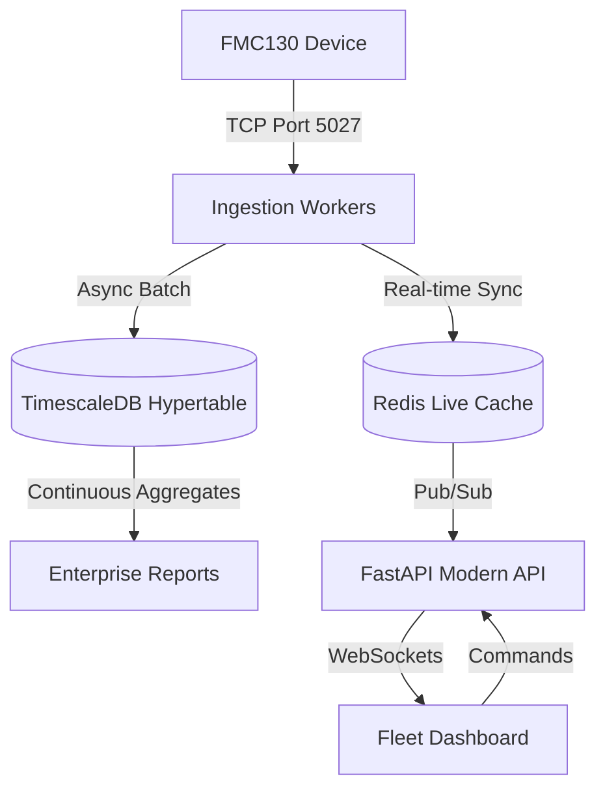

# Enterprise IVMS - Hardened Teltonika Infrastructure (v3.0)

Production-grade fleet management backend with direct Teltonika FMC130 integration, independent of Traccar, and optimized for massive scale.

## 🏗️ Architecture Overview

## 📁 Infrastructure Components
- **Ingestion Server**: Native Python AsyncIO engine with authoritative session management.
- **Analytics Engine**: Modular trip detection, overspeed monitoring, and driver behavior analysis.
- **Database (TimescaleDB)**: Partitioned, compressed, and aggregated telemetry storage.
- **API v2**: High-performance REST and WebSocket layer with diagnostic capabilities.

## 🚀 Enterprise Features

### 1. Hardened Ingestion (Phase 2-4)
- **Authoritative Sessions**: Ensures only one active socket per IMEI; kills ghost sessions automatically.
- **Zero-Packet Loss**: AsyncIO stream buffering with backpressure handling and CRC validation.
- **Cache Rebuilder**: Automatic Redis hydration from PostgreSQL on startup for 100% data consistency.

### 2. High-Scale Storage (Phase 6-7)
- **TimescaleDB Hypertables**: 7-day partitions with 365-day retention.
- **Continuous Aggregates**: Pre-calculated daily/monthly fleet stats for sub-second reporting.
- **Compression**: Automated 90% storage reduction for telemetry older than 7 days.

### 3. Analytics & Diagnostics (Phase 8-10)
- **Hybrid Trip Engine**: Logic for sustained overspeeding, harsh behavior, and ignition-based trips.
- **Packet Inspector**: Developer tools to view raw Hex vs Parsed JSON payloads.
- **Async Exports**: Background CSV/Excel generation for large datasets.

## 📡 Teltonika FMC130 Handshake
1. **Connect**: TCP to `72.61.254.210:5027`
2. **Handshake**: Device sends `00 0F` + IMEI -> Server replies `01`
3. **Ingestion**: Device sends AVL Data -> Server replies with 4-byte count ACK.

## 📊 Observability
- **Metrics**: Prometheus exporter on port `9090` (`teltonika_active_sessions`, `teltonika_packets_received_total`).
- **Health**: System diagnostics at `/api/v2/diagnostics/health`.

---
**Status**: PRODUCTION READY | Traccar-Free | Timescale-Optimized
