# STORAGE GROWTH FORECAST
**IVMS Production Environment Capacity Planning**
**Date:** May 31, 2026
**Status:** Completed (Audit & Planning Only)

---

## 1. Growth Estimation Methodology

This capacity planning model is based on actual audited metrics from the live IVMS production database:
* **Telemetry rate**: **1,500 records per vehicle per day** (calculated from active vehicles sending data at a standard ~1-minute frequency).
* **Uncompressed telemetry record size**: **800 bytes** (including b-tree indices, active for the first 7 days as per the TimescaleDB compression policy).
* **Compressed telemetry record size**: **15 bytes** (including metadata/index overhead, active for data older than 7 days).
* **Live position reconciliation rate**: **1 row in `live_position_updates` per telemetry record**.
* **Live position update record size**: **230 bytes** (including indices, standard uncompressed PostgreSQL table growing forever).
* **Alerts and operational logs**: **50 KB per vehicle per day**.

---

## 2. Growth Forecast Table

The table below forecasts total database storage requirements under two separate conditions:
1. **Unoptimized**: The current system setup (where telemetry compresses after 7 days, but `live_position_updates` and system logs grow uncompressed forever).
2. **Optimized**: Proposed design where `live_position_updates` is converted into a hypertable and compressed after 7 days, and system logs are pruned after 30 days.

| Metric | Scenario A (100 Vehicles) | Scenario B (500 Vehicles) | Scenario C (1,000 Vehicles) | Scenario D (5,000 Vehicles) |
| :--- | :--- | :--- | :--- | :--- |
| **Telemetry Points/Day** | 150,000 | 750,000 | 1,500,000 | 7,500,000 |
| **Daily Ingestion (Raw)** | 120 MB/day | 600 MB/day | 1.20 GB/day | 6.00 GB/day |
| **Uncompressed 7-Day Buffer**| 840 MB | 4.20 GB | 8.40 GB | 42.00 GB |
| **Daily Storage Growth (Unoptimized)** | **41.75 MB/day** | **208.75 MB/day** | **417.50 MB/day** | **2.09 GB/day** |
| **Daily Storage Growth (Optimized)** | **7.25 MB/day** | **36.25 MB/day** | **72.50 MB/day** | **362.50 MB/day** |

---

## 3. Storage Growth Projections (Unoptimized vs Optimized)

### 📈 Scenario A: 100 Vehicles

```mermaid
gantt
    title Storage over Time (100 Vehicles)
    dateFormat  X
    axisFormat %s
    section Unoptimized (77 GB Max)
    1 Year (16.1 GB)  :active, 0, 161
    3 Years (46.6 GB) :active, 0, 466
    5 Years (77.0 GB) :crit, active, 0, 770
    section Optimized
    1 Year (3.5 GB)   : 0, 35
    3 Years (8.8 GB)   : 0, 88
    5 Years (14.1 GB)  : 0, 141
```

* **Current Free Disk Space (76 GB) Exhaustion**: **~4.9 Years**.
* **Database Size Forecast**:
  * **1 Year**: Unoptimized: **16.08 GB** | Optimized: **3.49 GB**
  * **3 Years**: Unoptimized: **46.56 GB** | Optimized: **8.78 GB**
  * **5 Years**: Unoptimized: **77.04 GB** | Optimized: **14.07 GB**

---

### 📈 Scenario B: 500 Vehicles
* **Current Free Disk Space (76 GB) Exhaustion**: **~11.3 Months** (less than 1 year).
* **Database Size Forecast**:
  * **1 Year**: Unoptimized: **80.39 GB** | Optimized: **17.43 GB**
  * **3 Years**: Unoptimized: **232.77 GB** | Optimized: **43.89 GB**
  * **5 Years**: Unoptimized: **385.15 GB** | Optimized: **70.36 GB**

---

### 📈 Scenario C: 1,000 Vehicles
* **Current Free Disk Space (76 GB) Exhaustion**: **~5.7 Months**.
* **Database Size Forecast**:
  * **1 Year**: Unoptimized: **160.79 GB** | Optimized: **34.86 GB**
  * **3 Years**: Unoptimized: **465.57 GB** | Optimized: **87.79 GB**
  * **5 Years**: Unoptimized: **770.35 GB** | Optimized: **140.71 GB**

---

### 📈 Scenario D: 5,000 Vehicles
* **Current Free Disk Space (76 GB) Exhaustion**: **~36 Days**.
* **Database Size Forecast**:
  * **1 Year**: Unoptimized: **804.85 GB** | Optimized: **174.31 GB**
  * **3 Years**: Unoptimized: **2.33 TB**     | Optimized: **438.93 GB**
  * **5 Years**: Unoptimized: **3.86 TB**     | Optimized: **703.56 GB**

---

## 4. Key Takeaways & Storage Saturation Impact

### ⚠️ The Danger of Unoptimized Storage Growth
In the unoptimized model, **`live_position_updates` accounts for over 82% of long-term database storage!** Even though TimescaleDB compresses raw telemetry data effectively (from 120 MB down to 2.25 MB per day for 100 vehicles), the uncompressed live updates table accumulates 34.5 MB of data daily without restriction.

### 🛑 What happens when the disk becomes full?
1. **Database Lock**: PostgreSQL immediately goes into read-only transaction mode or crashes due to the inability to write to the WAL (Write Ahead Log).
2. **Ingestion Inundation**: The ingestion servers will lose their connection to the database. Incoming telemetry streams will back up in Redis. Since Redis memory is capped at 512MB in the Docker configuration, Redis will fill up in less than 30 minutes, leading to massive memory eviction and total loss of live vehicle telemetry.
3. **API & UI Outage**: APIs and the web dashboard will fail with 500 Server Errors, leaving fleet operators completely blind.
